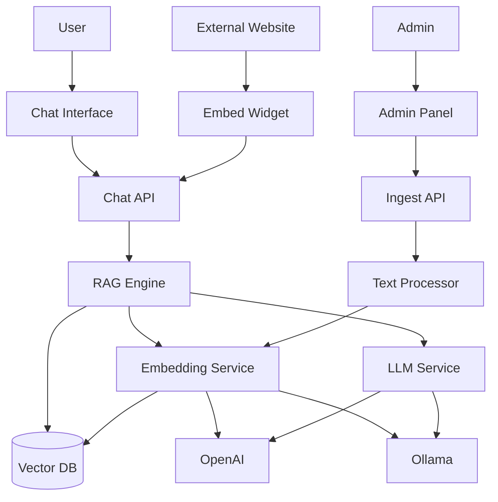
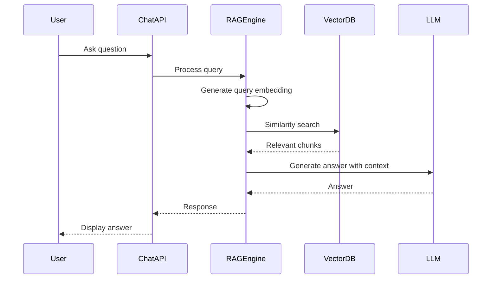

# KnowledgeBase AI

[](https://github.com/The-Atul-Sharma/KnowledgeBase-ai) [](https://github.com/The-Atul-Sharma/KnowledgeBase-ai) [](https://github.com/The-Atul-Sharma/KnowledgeBase-ai/issues) [](https://github.com/The-Atul-Sharma/KnowledgeBase-ai/blob/main/LICENCE) [](https://github.com/The-Atul-Sharma/KnowledgeBase-ai/pulls)

An AI-powered chatbot that answers questions about your products using RAG (Retrieval-Augmented Generation). Upload your product content, and the chatbot will provide accurate answers based on your knowledge base.

## System Architecture



## How It Works



**RAG Process:**

1. Content is chunked (900 chars, 150 overlap) and embedded
2. User queries are embedded and matched using cosine similarity
3. Relevant chunks are retrieved and used as context
4. LLM generates answers based on retrieved context

## Getting Started

```bash
npm install
npm run dev
```

## Environment Setup

Create `.env.local`:

```env
NEXT_PUBLIC_SUPABASE_URL=your-supabase-url
NEXT_PUBLIC_SUPABASE_PUBLISHABLE_DEFAULT_KEY=your-key
```

**Ollama Setup (optional):**

```bash
brew install ollama
ollama serve
ollama pull qwen3:4b-thinking-2507-q8_0
ollama pull nomic-embed-text
```

## Database Setup

Run in Supabase SQL Editor:

```sql
CREATE EXTENSION IF NOT EXISTS vector;

CREATE TABLE IF NOT EXISTS document_chunks (
  id UUID DEFAULT gen_random_uuid() PRIMARY KEY,
  content TEXT NOT NULL,
  metadata JSONB DEFAULT '{}'::jsonb,
  embedding vector(768),
  user_id UUID REFERENCES auth.users(id) ON DELETE CASCADE,
  created_at TIMESTAMP WITH TIME ZONE DEFAULT NOW(),
  updated_at TIMESTAMP WITH TIME ZONE DEFAULT NOW()
);

CREATE INDEX IF NOT EXISTS document_chunks_embedding_idx ON document_chunks
USING ivfflat (embedding vector_cosine_ops)
WITH (lists = 100);

CREATE INDEX IF NOT EXISTS document_chunks_created_at_idx ON document_chunks(created_at);

CREATE INDEX IF NOT EXISTS document_chunks_user_id_idx ON document_chunks(user_id);

CREATE OR REPLACE FUNCTION match_document_chunks(
  query_embedding vector(768),
  match_threshold float DEFAULT 0.7,
  match_count int DEFAULT 5,
  filter_user_id UUID DEFAULT NULL
)
RETURNS TABLE (
  id uuid,
  content text,
  metadata jsonb,
  similarity float
)
LANGUAGE plpgsql
AS $$
BEGIN
  RETURN QUERY
  SELECT
    document_chunks.id,
    document_chunks.content,
    document_chunks.metadata,
    1 - (document_chunks.embedding <=> query_embedding) AS similarity
  FROM document_chunks
  WHERE 1 - (document_chunks.embedding <=> query_embedding) >= match_threshold
    AND (filter_user_id IS NULL OR document_chunks.user_id = filter_user_id)
  ORDER BY document_chunks.embedding <=> query_embedding
  LIMIT match_count;
END;
$$;

CREATE TABLE IF NOT EXISTS app_settings (
  id UUID DEFAULT gen_random_uuid() PRIMARY KEY,
  user_id UUID REFERENCES auth.users(id) ON DELETE CASCADE,
  llm_provider TEXT NOT NULL DEFAULT 'ollama',
  embedding_provider TEXT NOT NULL DEFAULT 'ollama',
  openai_api_key TEXT,
  ollama_api_url TEXT DEFAULT 'http://127.0.0.1:11434',
  ollama_model TEXT DEFAULT 'qwen3:4b-thinking-2507-q8_0',
  ollama_embedding_model TEXT DEFAULT 'nomic-embed-text',
  chatbot_name TEXT DEFAULT 'Fin',
  header_title TEXT DEFAULT 'Knowledge Base Support',
  icon_url TEXT,
  greeting_message TEXT DEFAULT 'Hi there 👋 You are now speaking with Fin. How can I help?',
  custom_prompt TEXT,
  no_response_text TEXT DEFAULT 'I couldn''t find that in the current documentation, but I''m happy to help. Try rephrasing your question or asking about a specific feature.',
  input_placeholder TEXT DEFAULT 'Ask a question...',
  header_color TEXT DEFAULT '#3b82f6',
  header_text_color TEXT DEFAULT '#ffffff',
  response_card_color TEXT DEFAULT '#ffffff',
  response_text_color TEXT DEFAULT '#111827',
  response_metadata_color TEXT DEFAULT '#6b7280',
  user_card_color TEXT DEFAULT '#3b82f6',
  user_text_color TEXT DEFAULT '#ffffff',
  close_icon_color TEXT DEFAULT '#000000',
  close_icon_bg_color TEXT DEFAULT '#cccccc',
  chatbot_icon_bg_color TEXT DEFAULT '#3b82f6',
  send_icon_color TEXT DEFAULT '#3b82f6',
  created_at TIMESTAMP WITH TIME ZONE DEFAULT NOW(),
  updated_at TIMESTAMP WITH TIME ZONE DEFAULT NOW(),
  UNIQUE(user_id)
);

CREATE INDEX IF NOT EXISTS app_settings_user_id_idx ON app_settings(user_id);
```

## Features

- **RAG-powered**: Answers based on your uploaded content
- **Multi-tenant**: Isolated content per user
- **Embeddable**: Customizable widget for any website
- **Flexible**: Supports OpenAI and Ollama
- **Customizable**: Colors, messages, and branding

## Usage

1. Go to `/admin` to upload content
2. Configure LLM/embedding providers in Settings
3. Use `/` for chat interface or embed widget on external sites
