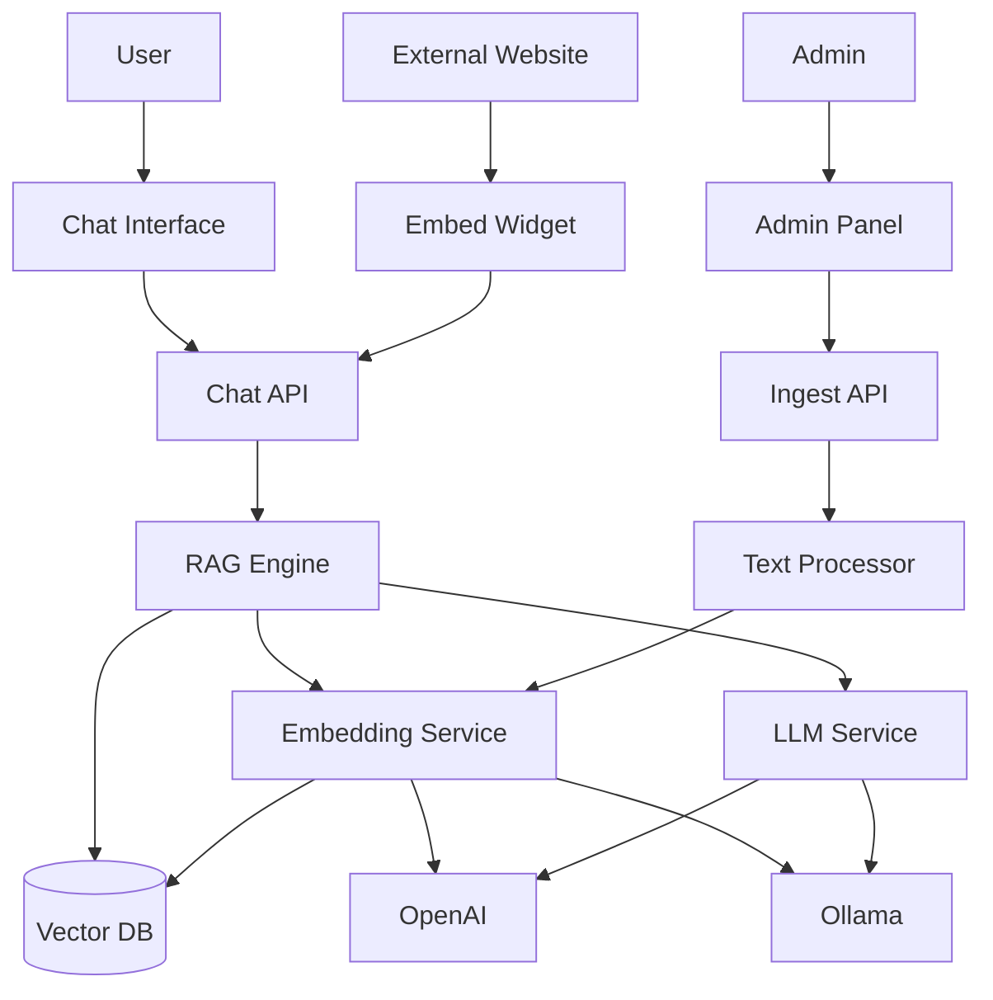
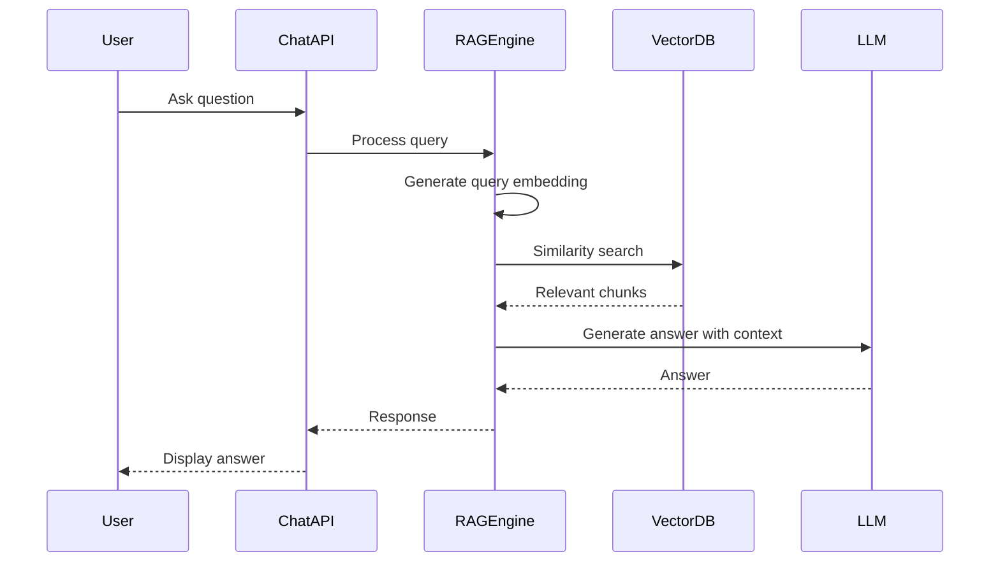

# KnowledgeBase AI

[](https://github.com/The-Atul-Sharma/KnowledgeBase-ai) [](https://github.com/The-Atul-Sharma/KnowledgeBase-ai) [](https://github.com/The-Atul-Sharma/KnowledgeBase-ai/issues) [](https://github.com/The-Atul-Sharma/KnowledgeBase-ai/blob/main/LICENCE) [](https://github.com/The-Atul-Sharma/KnowledgeBase-ai/pulls)

An AI-powered chatbot that answers questions about your products using RAG (Retrieval-Augmented Generation). Upload your product content, and the chatbot will provide accurate answers based on your knowledge base.

## System Architecture



## How It Works



**RAG Process:**

1. Content is chunked (900 chars, 150 overlap) and embedded
2. User queries are embedded and matched using cosine similarity
3. Relevant chunks are retrieved and used as context
4. LLM generates answers based on retrieved context

## Getting Started

```bash
npm install
npm run dev
```

## Environment Setup

Create `.env.local`:

```env
NEXT_PUBLIC_SUPABASE_URL=your-supabase-url
NEXT_PUBLIC_SUPABASE_PUBLISHABLE_DEFAULT_KEY=your-key
```

**Ollama Setup (optional):**

```bash
brew install ollama
ollama serve
ollama pull qwen3:4b-thinking-2507-q8_0
ollama pull nomic-embed-text
```

## Database Setup

Run in Supabase SQL Editor:

```sql
CREATE EXTENSION IF NOT EXISTS vector;

CREATE TABLE document_chunks (
  id UUID DEFAULT gen_random_uuid() PRIMARY KEY,
  content TEXT NOT NULL,
  metadata JSONB DEFAULT '{}'::jsonb,
  embedding vector(768),
  user_id UUID,
  created_at TIMESTAMP WITH TIME ZONE DEFAULT NOW()
);

CREATE INDEX document_chunks_embedding_idx ON document_chunks
USING ivfflat (embedding vector_cosine_ops) WITH (lists = 100);

CREATE TABLE app_settings (
  id UUID DEFAULT gen_random_uuid() PRIMARY KEY,
  user_id UUID REFERENCES auth.users(id) ON DELETE CASCADE UNIQUE,
  llm_provider TEXT DEFAULT 'ollama',
  embedding_provider TEXT DEFAULT 'ollama',
  openai_api_key TEXT,
  ollama_api_url TEXT DEFAULT 'http://127.0.0.1:11434',
  chatbot_name TEXT DEFAULT 'Fin',
  header_color TEXT DEFAULT '#3b82f6',
  created_at TIMESTAMP WITH TIME ZONE DEFAULT NOW()
);
```

## Features

- **RAG-powered**: Answers based on your uploaded content
- **Multi-tenant**: Isolated content per user
- **Embeddable**: Customizable widget for any website
- **Flexible**: Supports OpenAI and Ollama
- **Customizable**: Colors, messages, and branding

## Usage

1. Go to `/admin` to upload content
2. Configure LLM/embedding providers in Settings
3. Use `/` for chat interface or embed widget on external sites
